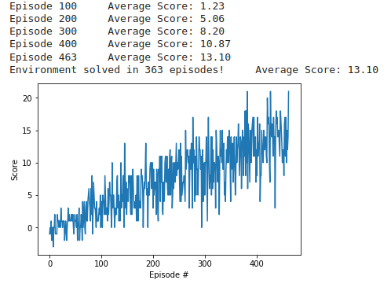

# Udacity Deep Reinforcement Learning: Navigation Report

## General Ideas of the implemented DQN Algorithm
  1. Off-policy Learning with Local & Target Q-Networks.
  2. Experience Delay with repetition learning and uncorrelated experience.
  3. The Local Q-Network is primarily trained with Simulated Experience generated by the Banana Environment, with Prediction from the Target Q-Network, and with the Expectation computed by itself.
  4. The Target Q-Network is not trained but updated softly with the parameters of the Local one.  
  5. The Q-Network architecture is simply a Neural Net with three fully connected layers (64 units per hidden layers).
  6. Epsilon w.r.t Epsilon Greedy method is the only hyperparameter optimized. The Decay represents a gradual shift from Exploration to Exploitation over time during the training process
  
## Plot of Rewards

## Ideas for Future Work
Try to implement the below algorithms on top of the current codebase:
  1. Double DQN
  2. Prioritized Experience Replay
  3. Dueling DQN
  4. Rainbow
